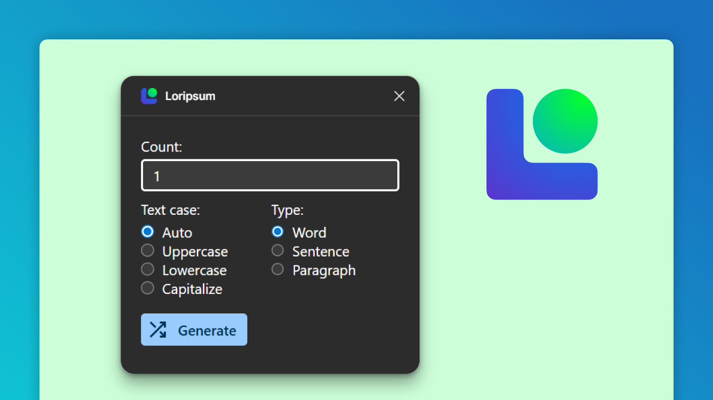
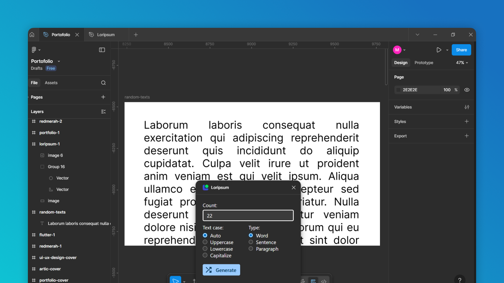

# Loripsum

Lorem ipsum generator for figma plugin. See plugin [here](https://www.figma.com/community/plugin/1539232405802126137/loripsum).

This generator is simple and easy to use. The reason I built this is because another 
plugin that I use to make lorem ipsum is not randomize the word order. The word order 
always the same for no matter how I generate.

But this plugin will randomize all word order every generate. So I will have unique
word/sentence/paragraph each time I need it.
